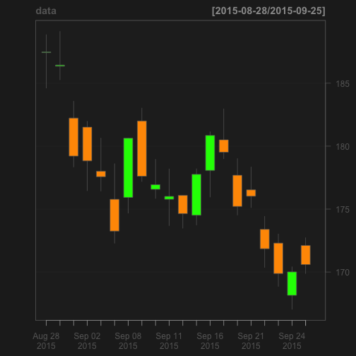

## Which Stocks are popular and Making Money?

1. R can easily parse stock market data
2. All you need is the quant library

--- .class #id 

## R Finance

With R Finance, simply 

> 1. enter the Stock you want to follow,
> 2. load the dates you are interested in and 
> 3. watch R Finance generate you stock data

---
## The Widget

What you will see is a candlestick chart of the stock price and the volume with which it traded.

---

## Behind the Widget

```r
require(quantmod)
data <- getSymbols("AMG", src ="yahoo", 
                   from = as.Date(Sys.Date()-30), 
                   to = as.character(Sys.Date()), auto.assign = FALSE)
                 
chartSeries(data, type = "candlesticks", TA = NULL)
```

 
---

## Acknowledgements

Thank You for your interest in R Finance
---
